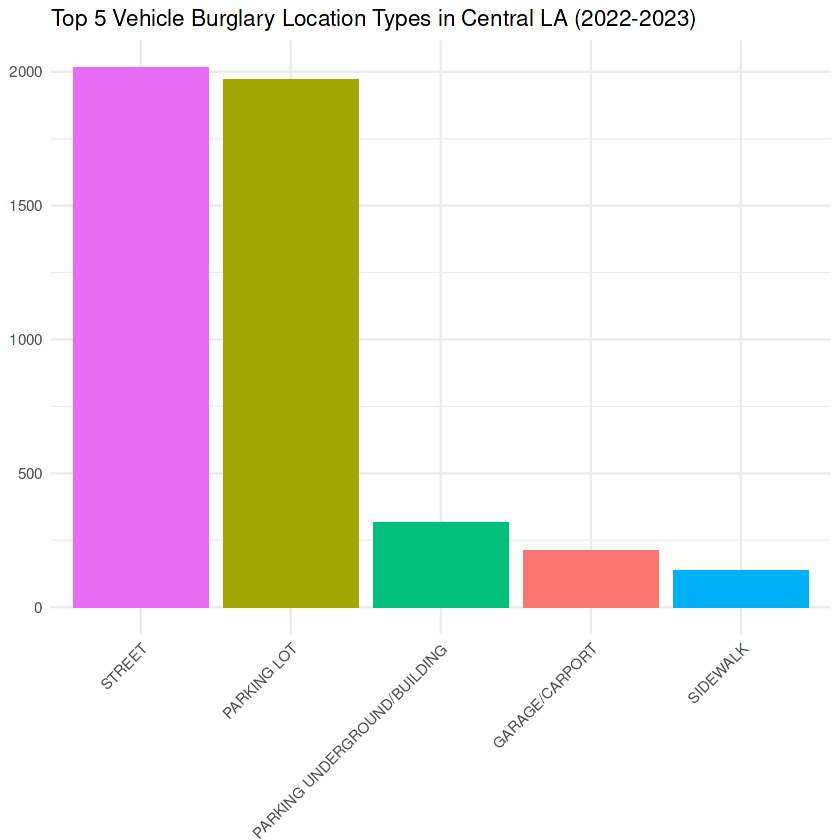
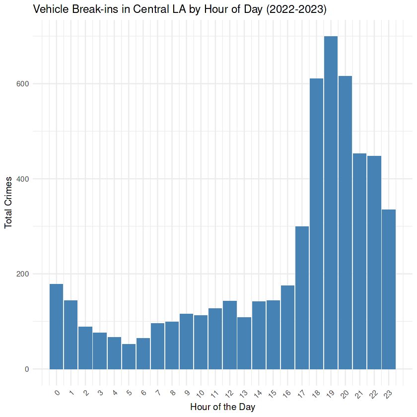

**Period covered:** 2020&#8211;2023 &middot; **Tools:** R (dplyr, ggplot2, lubridate), RStudio

## Overview

Using publicly available LAPD crime data, I isolated a 188% spike in vehicle burglaries in Central LA and identified the specific time windows driving it &#8212; 6PM to midnight, concentrated in parking areas &#8212; to support public safety resource planning.

## Approach

Data was obtained through LAcity.org and refined to exclude incomplete 2024 records. The dataset was cross-referenced against LAPD crime and MO codes to provide descriptive context for reported incidents, while geographic identities for each LAPD area were established using publicly available LAPD reference information.

## Findings

- **188% increase** in vehicle burglaries in Central LA over the period analyzed.
- Incidents concentrated in the **6PM&#8211;midnight** window.
- Parking areas were the highest-risk location type.

## Impact

By addressing resource allocation, infrastructure improvements, and increasing public awareness, actionable steps can be taken to combat an emergent trend of vehicle break-ins within Central LA. The data suggests these strategies would not only help reduce crime but also contribute to a safer environment for the public at large.

## Code

[View the analysis on Kaggle](https://www.kaggle.com/code/johnmasyczek/lapd-analysis/edit)
